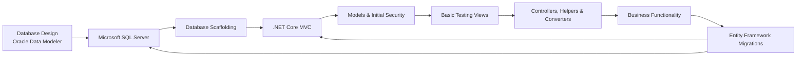
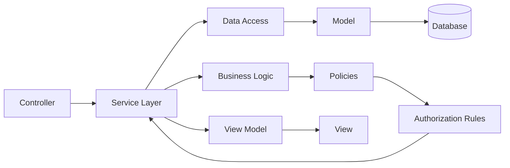

# Automated Staff Scheduling Application

## About the Project

This application was built to automate lesson and staff scheduling for an
educational institution. Before it existed, scheduling was a manual process spread
across spreadsheets and email — this app moves that into a single tool where
management builds the weekly schedule directly and constraints are checked
automatically instead of by hand.

Management can create a schedule for upcoming lessons in a few clicks. When
creating a schedule, the application takes several constraints into account: the
maximum permitted working hours for a teacher, holidays, classroom availability,
and the number of students attending a course versus the capacity of the room it's
assigned to. The goal is to prevent a course from ever being scheduled in a room
that's too small, already occupied, or on a day it shouldn't be.

Teachers only have access to their own schedule — the planning information shown
to each teacher is scoped to them, and they can't see schedules that aren't
theirs. A documentation search engine is also built in, so users can quickly find
relevant information without manually digging through it.

This repository is a **curated excerpt** of that application, not the full thing —
see [Repository scope](#repository-scope) for exactly what's included, what isn't,
and why. It's meant to be read as a portfolio piece, not cloned and run.

## What the application does

- **Schedule creation** — management builds a weekly/lesson schedule; the system
  checks maximum working hours, holidays, classroom availability and classroom
  capacity against the number of students before allowing it.
- **Room availability** — a live view of which classrooms are free right now,
  cross-checked against the active schedule for the current day and time.
- **Role-based access** — admin, director, secretariat and teacher roles via
  ASP.NET Identity; teachers only ever see their own schedule.
- **Search, sort & pagination** — a generic, reusable pattern (see
  [`SearchEngine.cs`](calenderapp-portfolio/Helpers/SearchEngine.cs)) applied
  consistently across every list screen in the app.
- **Documentation search** — a search engine over the available documentation, so
  users don't have to dig through it manually.

## Technologies

- C# / .NET Core
- ASP.NET Core MVC
- Microsoft SQL Server
- Entity Framework Core + EF Core Migrations
- LINQ and lambda expressions
- Oracle Data Modeler (initial schema design)
- HTML, CSS, JavaScript (front end — not included in this excerpt)

The application also makes use of asynchronous programming (`async`/`await`
throughout the controllers) and structured exception handling around every
database operation.

## Development Approach

The application was developed incrementally, starting with the database and
gradually building the application around it.

The initial database structure was designed using **Oracle Data Modeler**. The
required scripts and components were then adapted and rewritten for **Microsoft
SQL Server** — see [`Database scripts/`](calenderapp-portfolio/Database%20scripts)
for the raw DDL that came out of that process.

Once the initial SQL Server database existed, **database scaffolding** generated
the first models and DbContext for the ASP.NET Core MVC application. From that
point on, the database and the application were developed together — the initial
schema was a starting point, not a finished product, and changes to requirements
fed back into both the models and the schema via **EF Core migrations**.



This was iterative rather than a strict one-way pipeline: changes during
application development could require changes to the database, and vice versa.
After scaffolding, basic security restrictions were introduced on the models
early, a minimal view was used to confirm the database/model/MVC wiring worked,
and the application was then expanded gradually through controllers, helpers and
converters — testing individual parts as they were added rather than building
everything before testing anything.

## Architecture

The application follows the **MVC methodology** within ASP.NET Core, with the
database as the starting point rather than the UI.

**A generic search/sort/pagination layer instead of one per screen.**
[`SearchEngine.cs`](calenderapp-portfolio/Helpers/SearchEngine.cs) builds LINQ
expression trees at runtime from a property name and a search term, so every list
screen in the app (teachers, classrooms, programmes, schools, ...) gets sorting and
filtering "for free" instead of a hand-written `switch` per entity. Paired with
[`PaginatedList.cs`](calenderapp-portfolio/Helpers/PaginatedList.cs), that's the same
few lines of wiring in every `Index()` action across the app, rather than
duplicated per entity.

**Small, targeted converters instead of reaching for a bigger dependency.** HTML
checkboxes post `"on"`/`"off"`, not `true`/`false`, and `Newtonsoft.Json` has no
built-in support for `TimeOnly`. Rather than restructure the forms or switch JSON
libraries, both gaps are closed with a single-purpose `JsonConverter<T>` each — see
[`Converter/`](calenderapp-portfolio/Converter).

**A shared "detail/delete confirmation" view model.**
[`SRDViewModel`](calenderapp-portfolio/Models/ViewModels/SRDViewModel.cs) is used by
every entity's Details/Reset/Delete screens, so those pages render from a single
Razor partial instead of one per entity.

**A generic base controller + per-entity service for the CRUD screens.**
[`EntityCrudController<TEntity>`](calenderapp-portfolio/Controllers/EntityCrudController.cs)
implements `Index`/`DeleteIndex`/`Details` once, against an
[`IAuditableEntity`](calenderapp-portfolio/Models/IAuditableEntity.cs) contract that
`Docent`, `Lokaal`, `School` and `Opleiding` all implement. Each concrete controller
supplies only what's genuinely entity-specific: which `Settings` field controls its
page size, which properties show on the detail screen, and the `Create`/`Edit` form
parsing (left explicit on purpose — see [Future Improvements](#future-improvements)).
Backing it is [`AuditableEntityService<TEntity>`](calenderapp-portfolio/Services/AuditableEntityService.cs),
a small generic data-access layer that owns setting the audit fields and the
active/soft-deleted split, registered once per entity type in DI
(`AddScoped(typeof(AuditableEntityService<>))`).

The project focuses on:

- MVC architecture
- Database-driven, database-first development
- SQL Server + Entity Framework Core + migrations
- LINQ and lambda expressions
- Model-level validation and role-based authorization
- Asynchronous programming and structured exception handling
- Reusability (search/sort/pagination, shared view models) over per-screen code

## Working with Data

SQL Server and Entity Framework Core are used for all database interaction; LINQ
(with lambda expressions) is used to query and manipulate data throughout the
controllers. The initial database, designed in Oracle Data Modeler, was scaffolded
into the ASP.NET Core MVC application and then evolved alongside it — schema
changes required by new features were applied through EF Core migrations directly
from the development environment, rather than hand-edited on the server.

Two things that shaped the data layer in practice:

- **Soft deletes throughout.** Every entity carries `VerwijderDatum`/`VerwijderdDoor`
  (delete date/by) fields rather than being hard-deleted, so records can be
  restored and "who deleted what, when" stays auditable. See
  [`Docent.cs`](calenderapp-portfolio/Models/Docent.cs) or any other entity for the
  pattern.
- **Audit fields on every table.** `AanmaakDatum`/`AangemaaktDoor` (created)
  and `UpdateDatum`/`UpdatedDoor` (updated) are set consistently across every
  create/edit action.

## Security and Privacy

Security was considered from an early stage: basic model-level restrictions came
in right after the initial scaffolding, then the application was extended with
role-based authorization as it grew. Different roles get different access —
teachers are restricted to their own schedule, while management has the
permissions needed to create and manage schedules for everyone.

**About this repository specifically.** The real application also uses ASP.NET
Identity for authentication and contains references to the real institution it
was built for. Neither belongs in a public repo, so both have been handled
explicitly rather than just trimmed away:

- The original `CalenderAppContext` seeded a few development accounts through EF
  Core's `HasData()` — including the password hash and security stamp EF
  generates for a seeded user. That block is removed entirely here, not masked.
  Publishing a password hash is a bad idea even for a throwaway dev account,
  since it's crackable offline; only the harmless role seeding (role *names*,
  no accounts) is kept.
- `appsettings.json` is replaced by `appsettings.Example.json` with dummy values.
  Real connection strings were never meant to live in source control regardless
  of whether this became a public excerpt.
- References to the actual institution have been replaced with generic
  placeholders throughout the code and this README.
- The Identity UI scaffolding and Views are excluded entirely (as in the original
  project setup), and this excerpt goes further by also leaving out the
  `Migrations/` folder, since that's where the seeded credentials lived.

## Repository layout

```
calenderapp-portfolio/
├── Controllers/
│   ├── EntityCrudController.cs         generic base: list/search/sort/paginate/detail
│   ├── GebruikerRechtenController.cs   role management via ASP.NET Identity
│   ├── SettingsController.cs           app-wide settings (pagination sizes, contract hours)
│   ├── BeschikbaarLokaalController.cs  live classroom availability check
│   ├── DocentController.cs             teacher CRUD, extends EntityCrudController<Docent>
│   ├── LokaalController.cs             classroom CRUD, extends EntityCrudController<Lokaal>
│   ├── SchoolController.cs             institution CRUD, extends EntityCrudController<School>
│   └── OpleidingController.cs          programme/course CRUD, extends EntityCrudController<Opleiding>
├── Services/
│   ├── AuditableEntityService.cs       generic audit-field + soft-delete data access, per entity
│   └── RoomAvailabilityService.cs      the "is this room free right now" business rule
├── Models/                             entities used by the controllers above
├── Models/IAuditableEntity.cs          shared contract the generic service/controller depend on
├── Models/ViewModels/                  SRDViewModel, GebruikerRechtenViewModel
├── Helpers/                            SearchEngine + ISearchEngine, PaginatedList
├── Converter/                          custom Newtonsoft.Json converters (bool, TimeOnly)
├── Database scripts/                   raw SQL DDL for the schema
├── Properties/                         launchSettings.json, service dependency config
├── .config/dotnet-tools.json           local tool manifest (dotnet-ef)
├── Program.cs                          app startup / DI configuration
└── appsettings.Example.json            config shape, no real values
```

`Properties/` and `.config/` are included unchanged — `launchSettings.json` and the
two `serviceDependencies*.json` files only contain localhost ports and abstract
connection-string *key names*, never an actual server, credential or value, so
there was nothing to sanitize there.

## Repository scope

Of the 13 controllers in the real application, this excerpt includes **7** — the
ones above. The other 6 are intentionally left out:

- **`PlanningController`, `VakantieController`, `KalenderController` and
  `HomeController`** implement the actual scheduling engine: constraint checking,
  the calendar rendering/query logic, and holiday handling. This is both the most
  substantial part of the application to build and the part I'd rather not hand
  someone as a ready-made blueprint. What's included instead (the search/pagination
  layer, the availability check, the CRUD pattern) demonstrates the same
  engineering approach without shipping the engine itself.
- **`WeergaveLokalenController`** is a thin view over the same scheduling engine
  and doesn't add anything beyond what's already shown.
- **`ModuleController`** is functionally near-identical to the CRUD controllers
  that are included (same pattern, different entity) and would just be
  repetition.

**This excerpt won't compile standalone** — Views, the Identity UI scaffolding,
and several referenced entities/controllers from the scheduling engine aren't
included. It's meant to be read, not built.

## Development Responsibilities

### .NET Core Application Development
Design and development of an ASP.NET Core MVC application for staff/lesson
scheduling, including the business functionality required to make it usable by
non-technical staff (management, secretariat, teachers).

### Database Development
Designing the initial schema in Oracle Data Modeler, adapting it for Microsoft SQL
Server, and evolving it further through EF Core migrations as the application's
requirements changed.

### MVC Development
Scaffolding the initial MVC foundation from the database, then expanding it
through models, controllers, (Razor) views, helpers and converters.

### Back-End Development
Implementing business rules (scheduling constraints, room availability), database
interaction via EF Core, LINQ queries, asynchronous operations, and consistent
exception handling around every database-touching action.

### Front-End Development
HTML, CSS and JavaScript for the application's screens — not included in this
excerpt, since Views were excluded from the public repository.

### Data Management
SQL, SQL Server, Entity Framework Core, migrations and LINQ, with the schema
initially designed separately and later integrated into the MVC application
through scaffolding.

### Scheduling Logic *(described here, not included as code)*
The scheduling functionality accounts for teacher availability, maximum working
hours, holidays, classroom availability and capacity, and the number of students
attending a course — checking whether a suitable, available, large-enough room
exists before a course can be scheduled into it. This lives in the controllers
intentionally excluded from this repository (see
[Repository scope](#repository-scope)).

### Documentation Search
A search engine over the available documentation, to reduce the time needed to
manually search through it and get users to relevant information faster.

### Analysis and Design
Translating real business requirements — personnel planning, lesson scheduling,
working hours, holidays, classroom availability and student capacity — into a
working technical solution.

### Testing
A minimal view was created early on to verify the database/model/MVC wiring
end-to-end, after which individual parts of the application were tested and
adjusted as they were built. This made it possible to catch integration problems
early rather than only at the end.

## Business Functionality

Management can create schedules while taking into account maximum permitted
working hours, holidays, teacher availability, classroom availability and
capacity, and the number of students attending a course. The application checks
whether the selected classroom is both available and large enough before
accepting a schedule entry. Teachers can then view their own schedule without
access to anyone else's. A documentation search engine rounds out the toolset,
letting users find relevant information without digging through it manually.

The overall goal is to reduce manual planning effort, enforce real-world
constraints automatically instead of relying on someone remembering them, and
give management and teachers a clearer, shared source of truth for the schedule.

## Future Improvements

A few things I'd point to as the natural next steps for this codebase:

- **`Create`/`Edit` still parse a raw `IFormCollection` per entity** instead of
  binding to a strongly-typed, validated view model. Form fields are genuinely
  different per entity, so this stays explicit rather than forced into a generic
  shape — but moving to bound view models with data-annotation validation would
  still be a real improvement over manual `Convert.To...` calls per field.
- **`AuditableEntityService<T>` has no interface and no unit tests against it
  yet.** The abstraction makes both possible now; adding an interface only really
  pays off once there's a second implementation or a fake to test against.
- **The scheduling engine (`PlanningController`, `VakantieController`,
  `KalenderController`) is the part of the application with the most business
  logic packed into single methods** — see [Repository scope](#repository-scope)
  for why it isn't included here. It's also the part that would benefit most from
  the same kind of service-extraction applied to the availability check in this
  excerpt.

A structure I'd consider for pushing business rules and authorization out of the
controllers entirely, not just the data-access boilerplate:



The controller would handle the incoming request and delegate to a service, which
coordinates the business logic and talks to the data-access layer; a policy
decides whether the current user is allowed to see the result before it's
returned. This wouldn't replace MVC — it would just give each part of the
application a clearer, individually testable responsibility instead of
controllers doing all of it at once.

## What this project demonstrates

- ASP.NET Core MVC application design from a database-first starting point
- Entity Framework Core, including migrations to evolve a live schema
- LINQ and expression trees for generic, reusable query logic
- Role-based authorization with ASP.NET Identity
- Business-rule implementation around real-world scheduling constraints
- Iterative, requirements-driven development where the database and the
  application evolved together rather than the database being "finished" up front
- Awareness of what shouldn't ship in a public repository, and why (see
  [Security and Privacy](#security-and-privacy))
- Recognizing duplication and tight coupling and refactoring it behind a generic
  base controller, a shared service and explicit interfaces — without
  over-abstracting the parts that are genuinely fine left explicit (see
  [Future Improvements](#future-improvements))

## Development Summary

The project followed an iterative process where the database and application
evolved together: an initial schema (Oracle Data Modeler → SQL Server), scaffolded
into ASP.NET Core MVC, then gradually extended through security, testing views,
controllers, helpers, converters and business functionality — with the database
itself continuing to change through EF Core migrations as requirements became
clearer. The result is a database-driven ASP.NET Core MVC application for
personnel and lesson scheduling, built with real-world constraints (working
hours, holidays, room capacity) at its core.

## License

Shared for portfolio purposes only. Not licensed for reuse, redistribution or use
as a starting point for a similar application — see [Repository scope](#repository-scope)
for what's intentionally left out.
